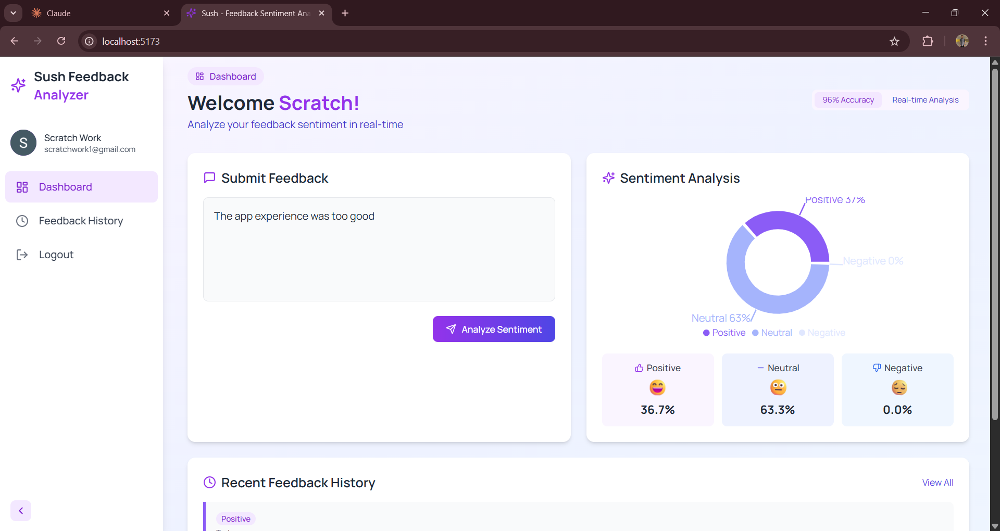

# 🚀 AI-Powered Feedback Analyzer

An intelligent, full-stack feedback analysis platform that leverages **Natural Language Processing**, **Multilingual Support**, **Real-Time Charts**, and **Performance Optimization** to help platforms make data-driven decisions from user feedback.  
Built with ❤️ using **Spring Boot**, **FastAPI**, **React.js**, **Redis**, **MySQL**, **Docker**, and **Tailwind CSS**.

![Demo Screenshot]
  

---

## 🔥 Features

- 🔐 **Google Authentication** for secure access
- 🌐 **Multilingual Sentiment Analysis** using Google Translate API
- 🟢🟡🔴 **Feedback Categorization**: Positive, Neutral, Negative
- 📊 **Pie Chart Visualization** for sentiment distribution
- 📈 **Monthly Sentiment Graphs** to track trends over time
- 🔁 **Pagination & Filtering** by sentiment type
- 🚀 **Redis Caching** to boost REST API performance
- 🐳 **Dockerized Services**: Spring Boot, FastAPI, MySQL, Redis
- ☁️ **Backend hosted on Railway**
- 🌐 **Frontend deployed on Netlify**
- 📱 **Mobile Responsive Design** using Tailwind CSS

---

## 🧰 Tech Stack

| Frontend      | Backend               | Database | DevOps & Infra |
|---------------|------------------------|----------|----------------|
| React.js      | Spring Boot (Java)     | MySQL    | Docker         |
| Tailwind CSS  | FastAPI (Python)       | Redis    | Railway        |
| Chart.js      | Google Translate API   |          | Netlify        |

---

## 📂 Project Structure

📁 FULL STACK SENTIMENT ANALYZER
├── 📁 Sentiment-Backend        # Spring Boot application for feedback APIs
├── 📁 Sentiment-Frontend       # React.js frontend (Netlify-ready)
├── 📁 Sentiment-Model          # FastAPI service for NLP + Google Translate
├── 📄 .env                     # Environment variables
├── 🖼️ dashboard.png             # Screenshot - Dashboard view
├── 🖼️ feedback history.png      # Screenshot - Feedback history view
├── 🖼️ login page.png            # Screenshot - Login page
└── 📄 README.md                # Project documentation

✨ Demo
🔗 Live Demo: https://sush-feedback-analyzer.netlify.app

🧪 Testing Tips
Test feedbacks in multiple languages (English, Hindi, Spanish, etc.)

Try various sentiments: positive, negative, neutral

Check cache speed improvement with repeated requests

Explore filtering and pagination in feedback lists

💡 Use Cases
Product or App Feedback Collection

Customer Support Insights

Survey Analysis & Reporting

Real-Time User Sentiment Monitoring

🙋‍♂️ About Me
I’m a BCA Student passionate about building intelligent web applications and scalable backend systems.
📢 I’m actively looking for internship or full-time opportunities in Full Stack Development and AI-Integrated Platforms.

Let's connect!
🔗 https://www.linkedin.com/in/susheel-panchabhai-958074295 | 🌐 https://susheel-portfolio-site.netlify.app

